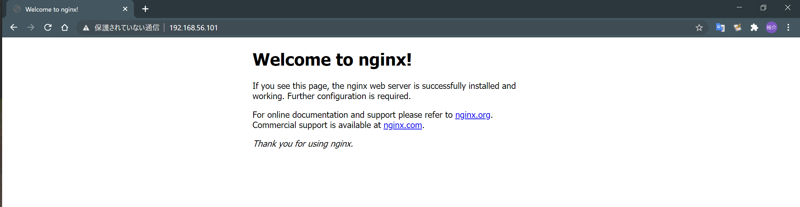

# nginxのインストール

## 基本情報

| 種別       | OS種別                | 接続先IPアドレス | 備考                |
| ---------- | --------------------- | ---------------- | ------------------- |
| ホストOS   | Windows 10 Home 64bit | -                | -                   |
| リモートOS | CentOS 7.9            | 192.168.56.101   | nginxをインストール |

## nginxのリポジトリを追加

nginxの公式方法のほうが最新のnginx入れられるのでこっちの方法をとった。
/etc/yum.repos.d/に追加する

~~~
# vi /etc/yum.repos.d/nginx.repo

[nginx]
name=nginx repo
baseurl=http://nginx.org/packages/centos/$releasever/$basearch/
gpgcheck=0
enabled=1
~~~

## nginxのインストールの実行

~~~
# yum install -y nginx

読み込んだプラグイン:fastestmirror
Loading mirror speeds from cached hostfile
 * base: ftp.yz.yamagata-u.ac.jp
 * extras: ftp.yz.yamagata-u.ac.jp
 * updates: ftp.yz.yamagata-u.ac.jp
nginx                                                                                  | 2.9 kB  00:00:00   

＜―――省略―――＞
インストール:
  nginx.x86_64 1:1.18.0-2.el7.ngx                                                                        

完了しました!

# nginx -V
nginx version: nginx/1.18.0
built by gcc 4.8.5 20150623 (Red Hat 4.8.5-39) (GCC) 
built with OpenSSL 1.0.2k-fips  26 Jan 2017
TLS SNI support enabled
configure arguments: --prefix=/etc/nginx --sbin-path=/usr/sbin/nginx --modules-path=/usr/lib64/nginx/modules --conf-path=/etc/nginx/nginx.conf --error-log-path=/var/log/nginx/error.log --http-log-path=/var/log/nginx/access.log --pid-path=/var/run/nginx.pid --lock-path=/var/run/nginx.lock --http-client-body-temp-path=/var/cache/nginx/client_temp --http-proxy-temp-path=/var/cache/nginx/proxy_temp --http-fastcgi-temp-path=/var/cache/nginx/fastcgi_temp --http-uwsgi-temp-path=/var/cache/nginx/uwsgi_temp --http-scgi-temp-path=/var/cache/nginx/scgi_temp --user=nginx --group=nginx --with-compat --with-file-aio --with-threads --with-http_addition_module --with-http_auth_request_module --with-http_dav_module --with-http_flv_module --with-http_gunzip_module --with-http_gzip_static_module --with-http_mp4_module --with-http_random_index_module --with-http_realip_module --with-http_secure_link_module --with-http_slice_module --with-http_ssl_module --with-http_stub_status_module --with-http_sub_module --with-http_v2_module --with-mail --with-mail_ssl_module --with-stream --with-stream_realip_module --with-stream_ssl_module --with-stream_ssl_preread_module --with-cc-opt='-O2 -g -pipe -Wall -Wp,-D_FORTIFY_SOURCE=2 -fexceptions -fstack-protector-strong --param=ssp-buffer-size=4 -grecord-gcc-switches -m64 -mtune=generic -fPIC' --with-ld-opt='-Wl,-z,relro -Wl,-z,now -pie'
~~~

## nginxの起動確認

~~~
# systemctl start nginx
# systemctl status nginx
● nginx.service - nginx - high performance web server
   Loaded: loaded (/usr/lib/systemd/system/nginx.service; disabled; vendor preset: disabled)
   Active: active (running) since 日 2021-03-07 02:37:10 JST; 27s ago
     Docs: http://nginx.org/en/docs/
  Process: 1578 ExecStart=/usr/sbin/nginx -c /etc/nginx/nginx.conf (code=exited, status=0/SUCCESS)
 Main PID: 1579 (nginx)
   CGroup: /system.slice/nginx.service
           tq1579 nginx: master process /usr/sbin/nginx -c /etc/nginx/nginx.conf
           mq1580 nginx: worker process

 3月 07 02:37:10 localhost.localdomain systemd[1]: Starting nginx - high performance web server...
 3月 07 02:37:10 localhost.localdomain systemd[1]: Can't open PID file /var/run/nginx.pid (yet?) after ...ory
 3月 07 02:37:10 localhost.localdomain systemd[1]: Started nginx - high performance web server.
Hint: Some lines were ellipsized, use -l to show in full.

# curl localhost
<!DOCTYPE html>
<html>
<head>
<title>Welcome to nginx!</title>

</head>
<body>
<h1>Welcome to nginx!</h1>

If you see this page, the nginx web server is successfully installed and
working. Further configuration is required.

For online documentation and support please refer to
<a href="http://nginx.org/">nginx.org</a>. 
Commercial support is available at
<a href="http://nginx.com/">nginx.com</a>.

<em>Thank you for using nginx.</em>

</body>
</html>
~~~

# ホストサーバからリモートサーバへのnginxへHTTPアクセス

今のままだと、ホストサーバからはSSH接続しか許していないため、HTTPでのアクセスを許可する。firewall-cmdでポートを開ける。

**現状の設定**

~~~
# firewall-cmd --permanent --zone=public --add-service=http --list-all
public (active)
  target: default
  icmp-block-inversion: no
  interfaces: enp0s3 enp0s8
  sources: 
  services: dhcpv6-client ssh
  ports: 
  protocols: 
  masquerade: no
  forward-ports: 
  source-ports: 
  icmp-blocks: 
  rich rules: 
~~~

**変更した設定**

~~~
# firewall-cmd --permanent --zone=public --add-service=http
success
# firewall-cmd --reload
success
# firewall-cmd --list-all
public (active)
  target: default
  icmp-block-inversion: no
  interfaces: enp0s3 enp0s8
  sources: 
  services: dhcpv6-client http ssh
  ports: 
  protocols: 
  masquerade: no
  forward-ports: 
  source-ports: 
  icmp-blocks: 
  rich rules: 
~~~

## ホストサーバのブラウザから接続

## Hostnameを変更する

ホスト名をdemo.local.comに変更

~~~sh
$ sudo hostnamectl set-hostname demo.local.com
$ hostname
demo.local.com
~~~

CentOS 7 の Hostname を変更する
<https://qiita.com/notakaos/items/d18ab37bce2b25b2d5b0>
